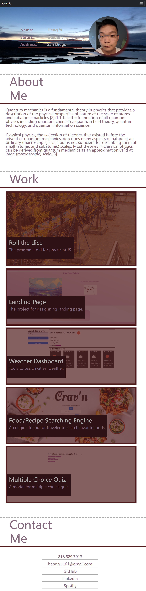
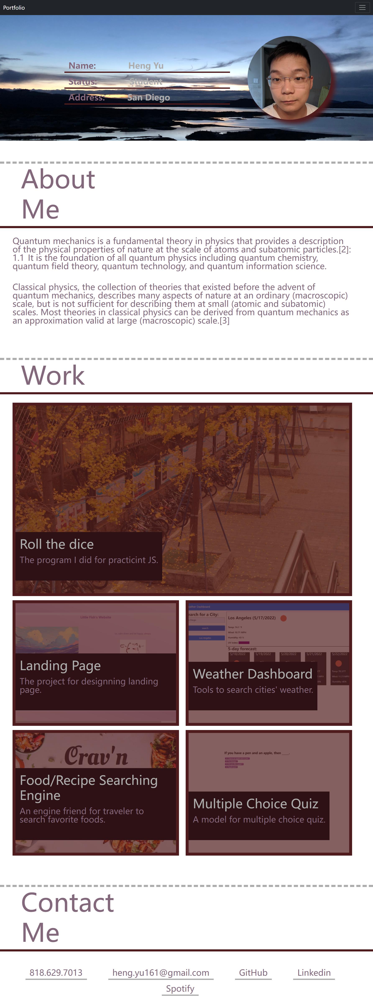

# UCSD_Updated-Portfolio
I am updating my portfolio page and other materials to build toward being employer-competitive.

## User Story

```
AS AN employer
I WANT to view a potential employee's deployed portfolio of work samples
SO THAT I can review samples of their work and assess whether they're a good candidate for an open position
```

## What I've done

I followed the whole requirements in the assignment "README.md" file, and here are some typical details to explain.

In this repository, I create a portfolio of mine, which includes five areas:

* Top bar with a navigation.

* A worker's information including: Photograph, Name, Status and Address.

* A brief introduction to this worker as "About Me".

* A Gallery about application this worker has done, when you click the image, then the browser will navigate you into the application as "Work".

* A contact information about the worker as "Contact Me"

## Some Details

This webpage has some simple functions as below:

* When you click the buttons on the navigation bar, it will scrolls to the corresponding section. (Due to the resume is not completed, so if you put your mouse on the "Resume" bar, it will occur a tooltip to explain it's not finished)

* On the "Work" section, when you hover your mouse on the images, the image will become bright. And open a new tab about the corresponded application the worker created when you click the image.

* On the "Contact Me" section, you could click those information to go to the corresponded webpage.

* It has a responsive layout that adapts to viewer's viewport. Which exactly separated with width "Screen<768px" "768px < Screen < 992px" "992px < Screen". Three different version.

## Screenshot with three different widths.

### Screen<768px (Small Version)


### 768px < Screen < 992px (Middle Version)


### 992px < Screen (Large Version)
